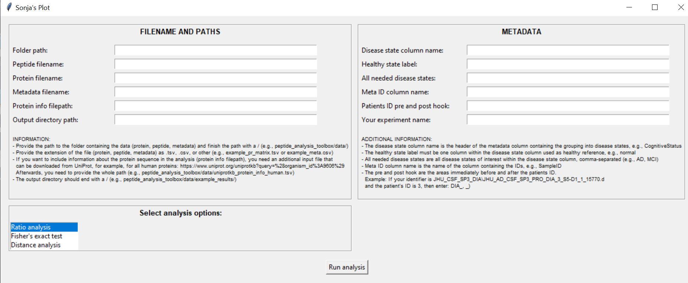

# GUI-pipdev

## Description
GUI-pipdev is an easy-to-use graphical interface for the pipdev tool developed by Sonja-Stockhaus. The pipdev tool itself can be found [here](https://github.com/Sonja-Stockhaus/devipep.git). Follow the installation instructions for pipdev before using the GUI.

## How to Install

### Shortcut Creation
1. **Create Shortcut**: Right-click on `devipep-GUI.py` and select "Create shortcut."
2. **Link Icon to Shortcut (Optional)**:
   - Download `Devipep-Icon.ico`.
   - Right-click on the shortcut, go to Properties.
   - Select the Shortcut tab.
   - Click on "Change icon," then "Select" and choose the downloaded icon.
   - Click "OK."

### Define the Target
1. **Set Target**:
   - In the shortcut's Properties menu under the Shortcut tab, enter the target path.
   - The target path combines the location of `GUI-pipdev.py` and the environment location, separated by a whitespace.
   - Example: 
     ```
     C:\Users\User123\AppData\Local\miniconda3\envs\sonjastool\python.exe C:/Users/User123/Documents/peptide_analysis_toolbox/GUI_pipdev.py
     ```
   - Click "OK" and close the menu.

## How to Run DEVIPEP GUI
- **Open DEVIPEP**: Double-click on the shortcut you created. A window like this will open:
  
  

- **Interface Overview**:
  - Enter all required information. Like on this picture:

    
    
  - Select an analysis option.
  - Click "Run analysis."

- **Save Analysis Results**:
  - The CSV file with analysis results will be saved in the provided path.
  - A new window will open for generating plots, like this:
    
    
    
    - If you choose to plot the topmost x plots, results will be saved in the provided results path.
    - Selecting a specific plot will open it in a new window.

### Contact

For questions and suggestions, please contact Katharina.Juraschek@childrens.harvard.edu.
Please use the "Issues" section for bug reports and feature requests.
